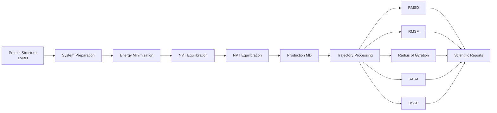

# Myoglobin 1MBN Molecular Dynamics

<p align="center">
  
</p>

<p align="center">
  
  
  
  
</p>

<p align="center">
  
</p>

<p align="center">
  <b>A complete molecular dynamics workflow for investigating structural stability, conformational behavior, and thermodynamic properties of Myoglobin (PDB: 1MBN).</b>
</p>

<p align="center">
  <b>Kaggle Link for trajectory files:</b>
  <br />
  <a href="https://www.kaggle.com/datasets/wasitkrish/myoglobin-1mbn-md-simulation">https://www.kaggle.com/datasets/wasitkrish/myoglobin-1mbn-md-simulation</a>
</p>

<p align="center">
  <em>Large trajectory files and heavyweight MD outputs are hosted on Kaggle so GitHub remains focused on the reproducible workflow, analysis scripts, and lightweight results.</em>
</p>

---

# 🧬 Project Overview

This repository presents a fully reproducible **Molecular Dynamics (MD) simulation and analysis workflow** for **Myoglobin (PDB ID: 1MBN)** using **GROMACS**, **MDAnalysis**, and the Python scientific computing ecosystem.

The project demonstrates an end-to-end computational biophysics pipeline covering:

* System preparation
* Energy minimization
* Equilibration
* Production molecular dynamics
* Trajectory processing
* Structural analysis
* Statistical reporting
* Scientific visualization

The repository is designed to provide a transparent and reproducible framework for studying protein dynamics while maintaining a lightweight GitHub footprint through external storage of large trajectory files.

---

# 📊 Featured Results

<p align="center">
  
  
  
</p>

<p align="center">
  <i>Structural Stability • Compactness • Solvent Accessibility</i>
</p>

---

# 🔍 Scientific Highlights

The simulation workflow evaluates multiple indicators of protein stability and conformational behavior:

✅ Structural deviation through RMSD analysis

✅ Residue-level flexibility through RMSF analysis

✅ Protein compactness using Radius of Gyration

✅ Solvent exposure through SASA calculations

✅ Secondary structure preservation via DSSP

✅ Thermodynamic stability through temperature, pressure, and energy monitoring

✅ Independent validation using MDAnalysis-based trajectory processing

Together, these analyses provide a comprehensive view of the dynamic behavior of Myoglobin throughout the simulation trajectory.

---

# 📈 Key Findings

Analysis of the generated trajectories indicates:

* Stable structural behavior throughout the production simulation
* Consistent radius of gyration suggesting preservation of overall protein compactness
* Maintained secondary structural elements across the trajectory
* Localized flexibility concentrated in specific residue regions
* Stable thermodynamic properties during simulation
* No evidence of major unfolding or catastrophic structural instability

These observations suggest that the simulated Myoglobin structure remained close to its native folded state under the selected simulation conditions.

---

# ⚙️ Simulation Workflow



---

# 📊 Project Statistics

| Metric                       | Value                         |
| ---------------------------- | ----------------------------- |
| Protein                      | Myoglobin (1MBN)              |
| Simulation Engine            | GROMACS                       |
| Analysis Framework           | MDAnalysis                    |
| Programming Language         | Python                        |
| Structural Metrics           | RMSD, RMSF, Rg, SASA          |
| Thermodynamic Metrics        | Temperature, Pressure, Energy |
| Secondary Structure Analysis | DSSP                          |
| Dataset Formats              | XVG, CSV, XLSX                |
| Visual Outputs               | Publication-Ready Figures     |
| Reproducibility              | Fully Scripted Workflow       |

---

# 📁 Repository Structure

```text
Myoglobin-1MBN-Simulation
│
├── Simulation
│   ├── inputs
│   ├── files
│   ├── dataset
│   ├── graphs
│   ├── info
│   ├── MDAnalysis
│   └── compressed
│
├── Datasets
│
└── README.md
```

---

# 🖼️ Analysis Gallery

<table>
<tr>
<td align="center">

<br><sub><b>RMSD</b></sub>
</td>

<td align="center">

<br><sub><b>RMSF</b></sub>
</td>

<td align="center">

<br><sub><b>Radius of Gyration</b></sub>
</td>
</tr>

<tr>
<td align="center">

<br><sub><b>SASA</b></sub>
</td>

<td align="center">

<br><sub><b>Temperature</b></sub>
</td>

<td align="center">

<br><sub><b>Pressure</b></sub>
</td>
</tr>

<tr>
<td align="center">

<br><sub><b>Total Energy</b></sub>
</td>

<td align="center">

<br><sub><b>DSSP</b></sub>
</td>

<td align="center">

<br><sub><b>MDAnalysis Validation</b></sub>
</td>
</tr>
</table>

---

# 🛠️ Technology Stack

### Molecular Simulation

* GROMACS

### Scientific Computing

* Python
* NumPy
* Pandas

### Trajectory Analysis

* MDAnalysis

### Data Visualization

* Matplotlib
* Seaborn

### Reporting & Export

* OpenPyXL
* ReportLab

### Version Control

* Git
* GitHub

---

# 🚀 Reproducing the Analysis

Install dependencies:

```bash
pip install numpy pandas matplotlib seaborn MDAnalysis openpyxl reportlab
```

Generate processed datasets:

```bash
bash Simulation/dataset/xvg-generate.sh
python Simulation/dataset/xvgtoexcel.py
```

Generate plots:

```bash
python Simulation/graphs/plotgenerator.py
```

Generate summary reports:

```bash
python Simulation/info/datainfo.py
```

---

# ☁️ Data Availability

To keep the GitHub repository lightweight, large simulation artifacts are hosted separately.

### GitHub Repository

Contains:

* Source code
* Analysis scripts
* Simulation inputs
* Documentation
* Processed datasets
* Generated figures

### Kaggle Dataset

Contains:

* Production trajectories (`.xtc`)
* Raw trajectory files (`.trr`)
* Checkpoints
* Intermediate simulation outputs
* Large binary artifacts

This separation enables full reproducibility while remaining compatible with GitHub storage limitations.

---

# 🎯 Applications

This workflow can serve as a foundation for:

* Molecular Dynamics education
* Computational biophysics projects
* Protein stability investigations
* Trajectory analysis workflows
* Scientific computing portfolios
* Reproducible research demonstrations

---

# 📚 Citation

If you use this repository or associated datasets in academic work, please cite:

* Myoglobin structure source (PDB ID: 1MBN)
* Associated simulation datasets
* Repository release version

Future versions may include DOI-backed releases and a `CITATION.cff` file for formal scholarly citation.

---

# 📜 License

Licensed under the MIT License.

Copyright © 2026

**Krish Singh**

---

<p align="center">
  🧬 Molecular Dynamics • Computational Biophysics • Scientific Computing
</p>
