# Myoglobin 1MBN Molecular Dynamics

<p align="center">
  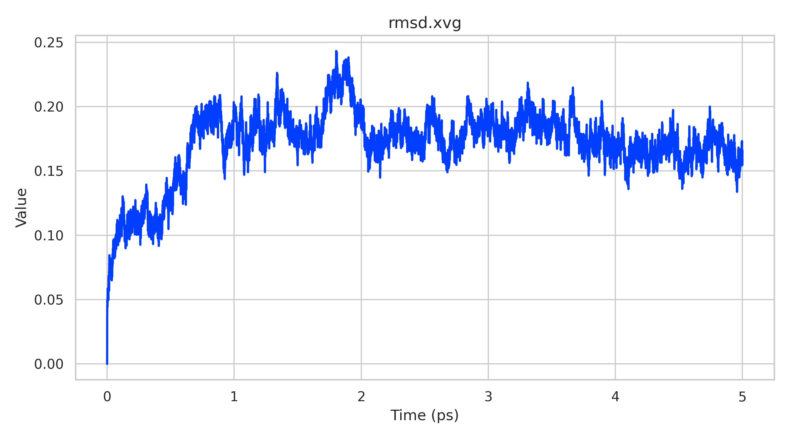
  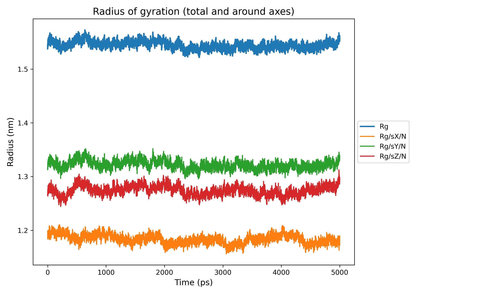
  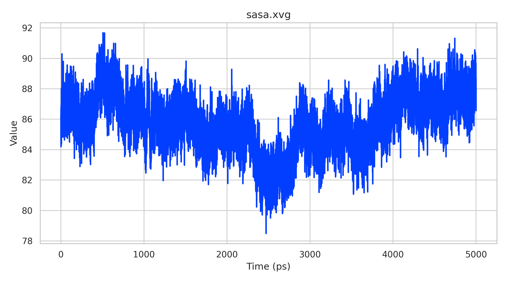
</p>

<p align="center">
  Reproducible GROMACS molecular dynamics analysis of myoglobin (PDB: 1MBN), with a GitHub-friendly codebase, publication-ready figures, and Kaggle-ready large trajectory data.
</p>

## Repository Metadata

**Suggested GitHub description**  
Reproducible GROMACS molecular dynamics simulation of myoglobin (1MBN) with analysis scripts, publication-ready figures, and Kaggle-hosted heavy trajectory data.

**Suggested GitHub topics / tags**  
`molecular-dynamics`, `gromacs`, `myoglobin`, `protein-dynamics`, `biophysics`, `trajectory-analysis`, `computational-biology`, `kaggle`, `reproducibility`, `scientific-computing`

## What This Repository Contains

This repository is organized around a full MD workflow for myoglobin:

- simulation setup and parameter files
- trajectory and energy analysis scripts
- XVG extraction and tabular consolidation
- publication-style plots, summary reports, and lightweight exported tables

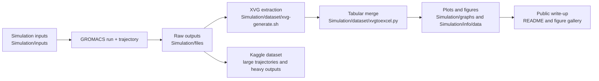

## Project Map

| Path | Purpose | Notes |
|---|---|---|
| `Simulation/inputs/` | GROMACS parameter files | EM, NVT, NPT, and production MD inputs |
| `Simulation/files/` | Simulation working directory | Topology, checkpoints, XVG outputs, and large raw trajectories |
| `Simulation/dataset/` | Extraction and tabular export | XVG processing script plus CSV/XLSX outputs |
| `Simulation/graphs/` | Plotting scripts and figures | Generated visualizations for the MD observables |
| `Simulation/info/` | Report generation | Summary statistics and PDF/CSV report assets |
| `Simulation/MDAnalysis/` | Python trajectory analysis | MDAnalysis workflow and output figures |
| `Simulation/compressed/` | Bundled artifacts | Zip archives for selected generated data |
| `Datasets/` | Lightweight exported tables | CSV/XLSX outputs for direct reuse |

## Key Figures

These are the most useful images to feature in the README and project landing page:

<table>
  <tr>
    <td align="center"><br><sub>RMSD</sub></td>
    <td align="center">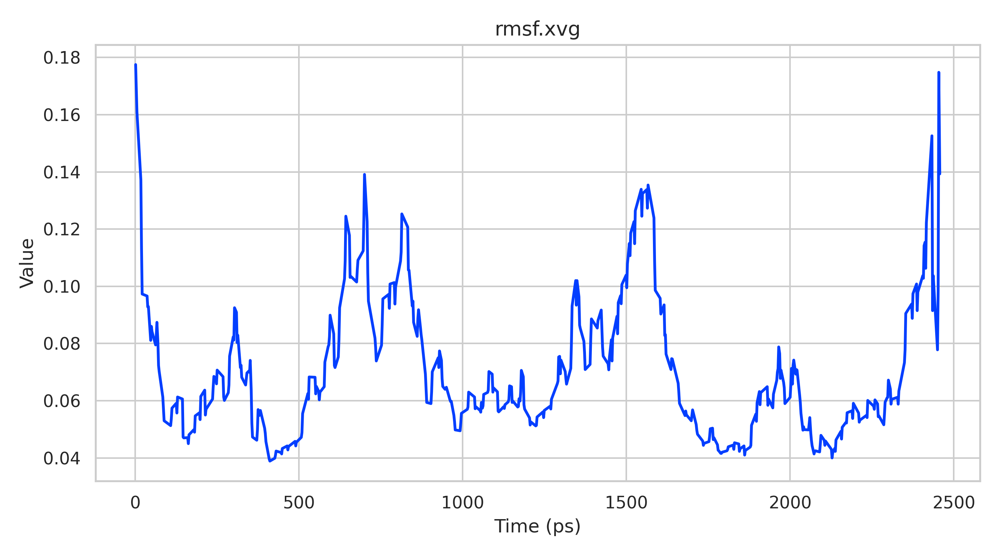<br><sub>RMSF</sub></td>
    <td align="center">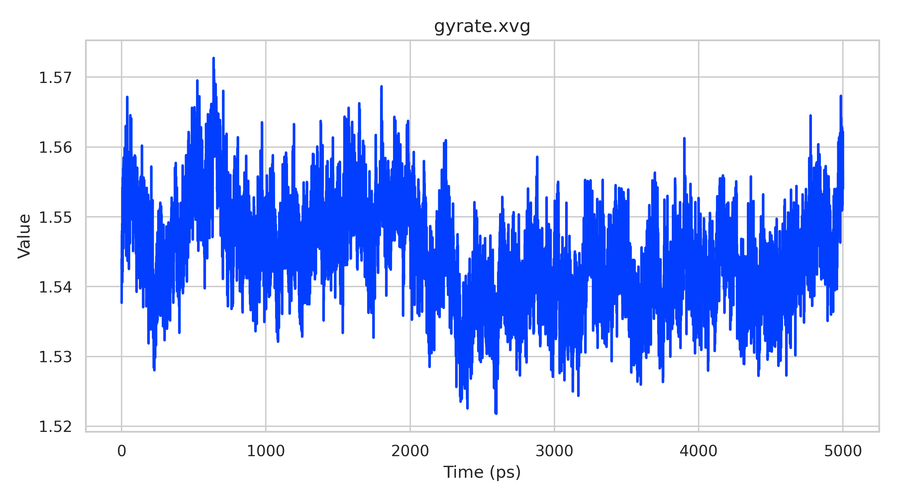<br><sub>Radius of gyration</sub></td>
  </tr>
  <tr>
    <td align="center"><br><sub>SASA</sub></td>
    <td align="center">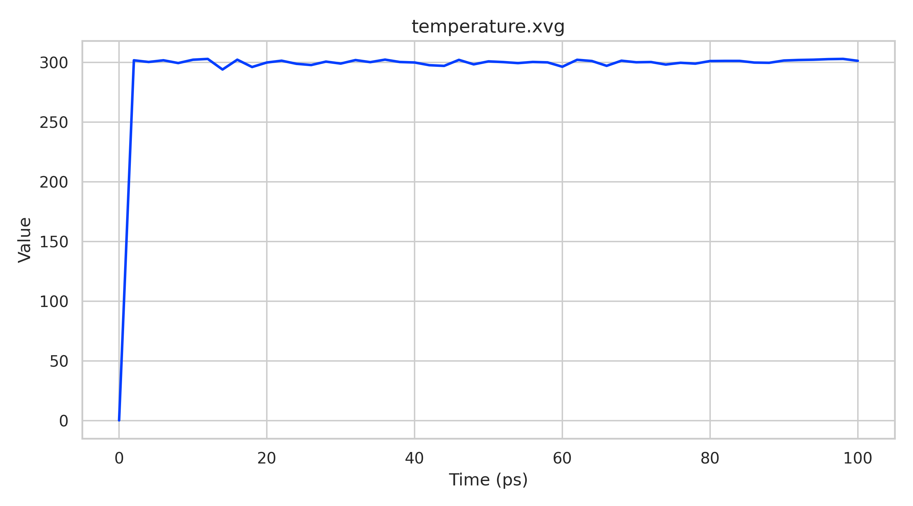<br><sub>Temperature</sub></td>
    <td align="center">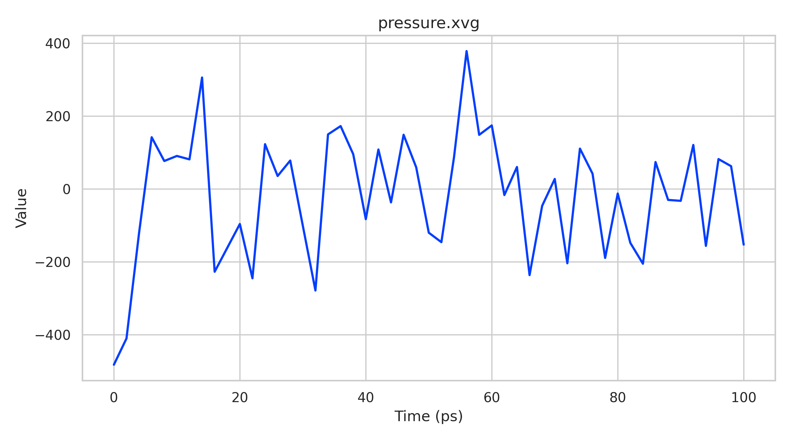<br><sub>Pressure</sub></td>
  </tr>
  <tr>
    <td align="center">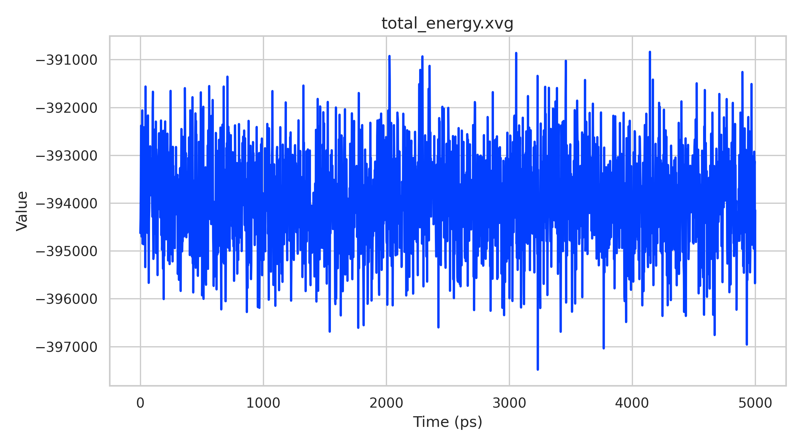<br><sub>Total energy</sub></td>
    <td align="center">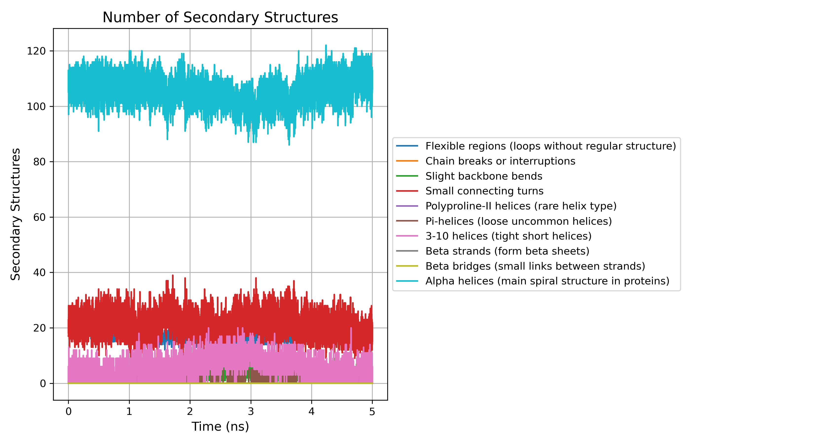<br><sub>DSSP secondary structure</sub></td>
    <td align="center">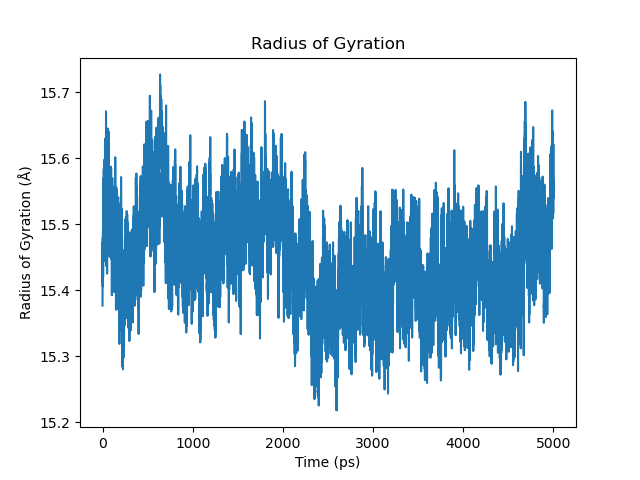<br><sub>MDAnalysis radius of gyration</sub></td>
  </tr>
</table>

## Recommended Figures To Keep In The README

If you want a tighter landing page, keep these four near the top:

- [RMSD](Simulation/graphs/plots/rmsd.png)
- [Radius of gyration](Simulation/graphs/plots/gyrate_multi.png)
- [SASA](Simulation/graphs/plots/sasa.png)
- [DSSP secondary structure](Simulation/graphs/plots/DSSP.png)

If you want a broader scientific summary, also include:

- [RMSF](Simulation/graphs/plots/rmsf.png)
- [Temperature](Simulation/graphs/plots/temperature.png)
- [Pressure](Simulation/graphs/plots/pressure.png)
- [Total energy](Simulation/graphs/plots/total_energy.png)

## Reproducibility

Install the Python dependencies used by the analysis scripts:

```bash
pip install numpy pandas matplotlib seaborn MDAnalysis openpyxl reportlab
```

If you are regenerating the raw MD workflow, GROMACS also needs to be available on your system.

Typical workflow:

```bash
bash Simulation/dataset/xvg-generate.sh
python Simulation/dataset/xvgtoexcel.py
python Simulation/graphs/plotgenerator.py
python Simulation/info/datainfo.py
```

Check the working tree before publishing:

```bash
git status --short
```

## GitHub Versus Kaggle

GitHub keeps the code and lightweight results:

- source scripts
- simulation inputs
- summary plots
- documentation and reproducibility notes

Kaggle should hold the heavy raw artifacts:

- long trajectories such as `.xtc` and `.trr`
- large intermediate outputs and checkpoints
- dataset versions intended for public download

## Release Notes

- The repository was reorganized so the main project lives under `Simulation/`.
- Lightweight exported tables are available in `Datasets/`.
- Large trajectory files are intentionally managed outside normal GitHub usage.
- The images in this README are already present in the repository and can be referenced directly.

## Citation and Credit

If you use this project, cite the simulation data and analysis workflow alongside the myoglobin structure source (PDB: 1MBN). Adding a `CITATION.cff` file and a DOI-backed release is recommended for the final public version.
