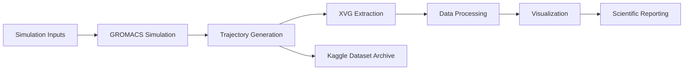

<!-- Banner Header -->

<p align="center">
  
</p>

<p align="center">
  
  
  
  
</p>

<p align="center">
  <b>Reproducible Molecular Dynamics Simulation and Analysis of Myoglobin (PDB: 1MBN)</b>
</p>

---

## 🧬 Project Overview

This repository contains a complete **Molecular Dynamics (MD) simulation workflow**
for the oxygen-binding protein **Myoglobin (PDB ID: 1MBN)** using **GROMACS** and
Python-based post-processing tools.

The project includes:

* Simulation parameter files
* Trajectory analysis workflows
* Automated XVG extraction pipelines
* Statistical summaries
* Publication-quality visualizations
* Lightweight datasets for GitHub
* Kaggle-hosted large trajectory data

The repository is designed to be **fully reproducible, research-oriented, and GitHub friendly**, while maintaining compatibility with large-scale datasets hosted externally.

---

## 📊 Featured Results

<p align="center">
  
  
  
</p>

<p align="center">
  Structural Stability • Compactness • Solvent Accessibility
</p>

---

## 🎓 Research Context

Molecular Dynamics simulations provide atomistic insights into protein behavior
under physiological conditions.

This project investigates:

* Structural stability of myoglobin
* Conformational fluctuations
* Protein compactness
* Solvent exposure characteristics
* Secondary structure evolution
* Energetic behavior throughout simulation

The workflow demonstrates the application of computational biophysics techniques
for protein dynamics analysis and serves as a practical reference for students,
researchers, and molecular simulation enthusiasts.

---

## 🔬 Scientific Workflow



---

## 📁 Repository Structure

| Directory                | Description                                   |
| ------------------------ | --------------------------------------------- |
| `Simulation/inputs/`     | GROMACS parameter and simulation input files  |
| `Simulation/files/`      | Raw simulation outputs and intermediate files |
| `Simulation/dataset/`    | XVG extraction and dataset generation scripts |
| `Simulation/graphs/`     | Plot generation scripts and figure outputs    |
| `Simulation/info/`       | Statistical summaries and report assets       |
| `Simulation/MDAnalysis/` | Advanced trajectory analysis workflows        |
| `Simulation/compressed/` | Archived generated outputs                    |
| `Datasets/`              | Lightweight CSV and XLSX datasets             |

---

## 📈 Analysis Performed

The repository includes automated generation and analysis of:

### 🧭 Structural Metrics

* Root Mean Square Deviation (RMSD)
* Root Mean Square Fluctuation (RMSF)
* Radius of Gyration (Rg)
* Solvent Accessible Surface Area (SASA)

### 🌡️ Thermodynamic Properties

* Temperature
* Pressure
* Total Energy
* Energy Stability Analysis

### 🧬 Structural Characterization

* DSSP Secondary Structure Analysis
* Conformational Stability Assessment
* Protein Compactness Evaluation

### 📊 Data Products

* XVG files
* CSV exports
* Excel spreadsheets
* Summary statistics
* Publication-ready figures

---

## 🖼️ Figure Gallery

<table>
  <tr>
    <td align="center">
      
      <br><sub>RMSD Analysis</sub>
    </td>
    <td align="center">
      
      <br><sub>RMSF Analysis</sub>
    </td>
    <td align="center">
      
      <br><sub>Radius of Gyration</sub>
    </td>
  </tr>

  <tr>
    <td align="center">
      
      <br><sub>SASA</sub>
    </td>
    <td align="center">
      
      <br><sub>Temperature</sub>
    </td>
    <td align="center">
      
      <br><sub>Pressure</sub>
    </td>
  </tr>

  <tr>
    <td align="center">
      
      <br><sub>Total Energy</sub>
    </td>
    <td align="center">
      
      <br><sub>DSSP Analysis</sub>
    </td>
    <td align="center">
      
      <br><sub>MDAnalysis Validation</sub>
    </td>
  </tr>
</table>

---

## 🛠️ Software Stack

### Molecular Simulation

* GROMACS

### Data Processing

* Python
* NumPy
* Pandas

### Trajectory Analysis

* MDAnalysis

### Visualization

* Matplotlib
* Seaborn

### Reporting

* OpenPyXL
* ReportLab

### Version Control

* Git
* GitHub

---

## 🚀 Reproducibility

Install required Python packages:

```bash
pip install numpy pandas matplotlib seaborn MDAnalysis openpyxl reportlab
```

Run the complete analysis workflow:

```bash
bash Simulation/dataset/xvg-generate.sh

python Simulation/dataset/xvgtoexcel.py

python Simulation/graphs/plotgenerator.py

python Simulation/info/datainfo.py
```

Verify repository status:

```bash
git status --short
```

---

## ☁️ GitHub & Kaggle Data Strategy

### GitHub Repository

Contains:

* Source code
* Analysis scripts
* Documentation
* Simulation parameters
* Processed datasets
* Scientific figures

### Kaggle Dataset

Stores:

* Large `.xtc` trajectories
* `.trr` files
* Checkpoints
* Intermediate simulation outputs
* Heavy binary artifacts

This approach keeps the repository lightweight while preserving complete reproducibility.

---

## 🎯 Learning & Research Objectives

This project aims to:

* Understand protein dynamics through MD simulation
* Develop reproducible scientific workflows
* Apply computational biophysics methodologies
* Perform trajectory-based structural analysis
* Generate publication-quality scientific visualizations
* Practice large-scale scientific data management

---

## 📌 Notes

* Large trajectory files are intentionally excluded from GitHub.
* GitHub hosts lightweight datasets and reproducible code.
* Kaggle hosts complete downloadable simulation outputs.
* All figures included in this repository are generated directly from simulation data.
* The project structure is designed for long-term maintainability and reproducibility.

---

## 📚 Citation

If you use this repository in academic work, please cite:

* Myoglobin structure source (**PDB: 1MBN**)
* Associated simulation datasets
* Repository release version

A future DOI-backed release and `CITATION.cff` file are recommended for formal scholarly citation.

---

## 📜 License

This project is licensed under the **MIT License**.

Copyright (c) 2026

**Krish Singh**

---

<p align="center">
  🧬 Computational Biophysics • Molecular Dynamics • Scientific Computing
</p>
<p align="center">
  
</p>
